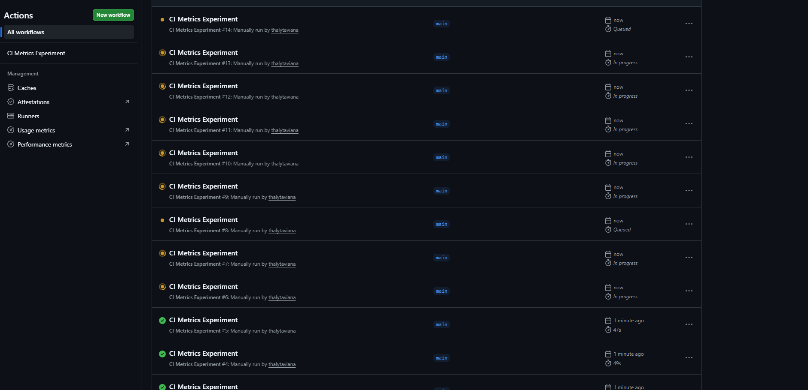
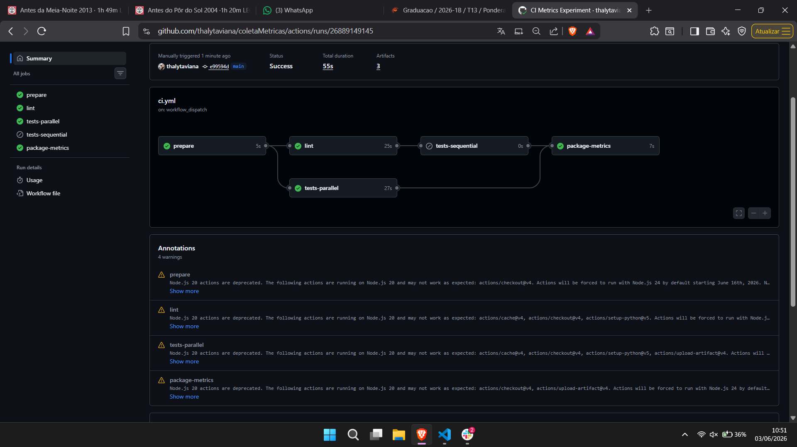
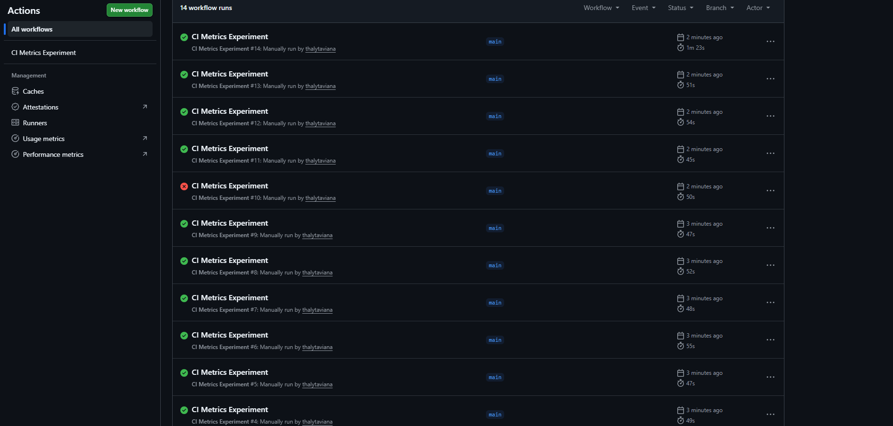

# coletaMetricas

Experimento prático para instrumentar um pipeline CI/CD no GitHub Actions, coletar métricas reais de execução, gerar gráficos e produzir um relatório técnico.

Repositório GitHub: https://github.com/thalytaviana/coletaMetricas

## Estrutura

- `.github/workflows/ci.yml`: pipeline com instalação de dependências, cache opcional, lint, testes, resumo de métricas e upload de artefatos.
- `src/coleta_metricas/`: aplicação Python simples usada pelos testes.
- `tests/`: testes automatizados com variações controladas por variáveis de ambiente.
- `scripts/summarize_pytest.py`: resume o JUnit XML do pytest em JSON.
- `scripts/collect_metrics.py`: **coleta programática** via API REST do GitHub Actions (não manual) e gera CSV.
- `scripts/generate_charts.py`: gera os quatro gráficos obrigatórios com Matplotlib + Pandas a partir do CSV.
- `scripts/dispatch_experiment_runs.py`: dispara as 12 execuções planejadas via `workflow_dispatch`.
- `data/experiment_plan.csv`: plano sugerido para as 12 execuções.
- `docs/relatorio.md`: relatório técnico em Markdown, com seções obrigatórias.

## Como executar localmente

```powershell
python -m venv .venv
.\.venv\Scripts\Activate.ps1
pip install -r requirements-dev.txt
python -m ruff check .
python -m pytest --junitxml=reports/junit.xml
python scripts/summarize_pytest.py reports/junit.xml --output reports/test-summary.json
```

Para simular variações localmente:

```powershell
$env:EXTRA_TEST_CASES="30"
$env:SLOW_TEST_SECONDS="2"
$env:FORCE_TEST_FAILURE="false"
python -m pytest --junitxml=reports/junit.xml
```

## Como executar o experimento no GitHub

### Pré-requisitos

- Conta GitHub com repositório público ou privado
- Token GitHub com permissões: `actions:read`, `actions:write`, `repo:status`
- Python 3.9+ instalado localmente
- git configurado

### Passo 1: Preparação do repositório

1. Clone o repositório:
```bash
git clone https://github.com/thalytaviana/coletaMetricas
cd coletaMetricas
```

2. Crie uma branch `main` (se não existir) e certifique-se de estar nela:
```bash
git checkout -b main  # ou git checkout main
git push origin main
```

3. Acesse a aba **Actions** no GitHub para confirmar que `.github/workflows/ci.yml` está visível.

### Passo 2: Disparar as 12 execuções planejadas

#### Opção A: Automática via API (recomendado)

1. Configure o token GitHub:
```powershell
$env:GITHUB_TOKEN="ghp_xxxxxxxxxxxxxxxxxxxx"  # token com permissões actions:write
```

2. Execute o script de disparo:
```powershell
python scripts/dispatch_experiment_runs.py `
  --repo usuario/coletaMetricas `
  --workflow ci.yml `
  --ref main `
  --plan data/experiment_plan.csv
```

3. O script disparará as 12 execuções variando os parâmetros em `experiment_plan.csv`.

#### Opção B: Manual via variações de commit

Para cada variação em `experiment_plan.csv`:

1. Altere `experiment.env` com os valores da variação
2. Commit: `git commit -am "Experimento: nome_da_variacao"`
3. Push: `git push origin main`
4. GitHub Actions dispara automaticamente ao fazer push

**Variações do experimento** (definidas em `data/experiment_plan.csv`):

| Variação | Cache | Modo | Testes | Teste Lento | Falha | ID esperado |
|----------|-------|------|--------|------------|-------|-------------|
| baseline_verde | enabled | parallel | 8 | 0s | false | Execução 1 |
| baseline_repetido_cache_quente | enabled | parallel | 8 | 0s | false | Execução 2 |
| cache_desligado | disabled | parallel | 8 | 0s | false | Execução 3 |
| mais_testes | enabled | parallel | 30 | 0s | false | Execução 4 |
| muitos_testes | enabled | parallel | 80 | 0s | false | Execução 5 |
| teste_lento_1s | enabled | parallel | 8 | 1s | false | Execução 6 |
| teste_lento_3s | enabled | parallel | 8 | 3s | false | Execução 7 |
| falha_controlada | enabled | parallel | 8 | 0s | true | Execução 8 |
| recuperacao_pos_falha | enabled | parallel | 8 | 0s | false | Execução 9 |
| cache_desligado_com_muitos_testes | disabled | parallel | 80 | 0s | false | Execução 10 |
| paralelo_com_muitos_testes | enabled | parallel | 80 | 0s | false | Execução 11 |
| sequencial_com_muitos_testes | enabled | sequential | 80 | 0s | false | Execução 12 |

#### Explicação detalhada das variações

**Grupo 1: Baseline e cache (Exe 1-3)**
- **Execução 1 (baseline_verde):** Baseline com todos os parâmetros padrão (cache ON, 8 testes, paralelo)
- **Execução 2 (baseline_repetido_cache_quente):** Repetição do baseline com cache já preaquecido
- **Execução 3 (cache_desligado):** Mesmas condições do baseline, mas sem cache - mede impacto do cache

**Grupo 2: Volume de testes (Exe 4-5)**
- **Execução 4 (mais_testes):** Aumenta testes de 8 para 30 (+275%) - mede escalabilidade
- **Execução 5 (muitos_testes):** Aumenta testes de 8 para 80 (+900%) - mede gargalo de testes

**Grupo 3: Testes lentos (Exe 6-7)**
- **Execução 6 (teste_lento_1s):** Adiciona delay artificial de 1s em cada teste (8 × 1s)
- **Execução 7 (teste_lento_3s):** Adiciona delay artificial de 3s em cada teste (8 × 3s) - mede impacto do tempo de teste

**Grupo 4: Falhas controladas (Exe 8-9)**
- **Execução 8 (falha_controlada):** Força uma falha intencional no teste - mede tempo até falha ser detectada
- **Execução 9 (recuperacao_pos_falha):** Volta ao baseline após falha - mede se pipeline recupera

**Grupo 5: Combinações críticas (Exe 10-12)**
- **Execução 10 (cache_desligado_com_muitos_testes):** Testa volume ALTO sem cache - caso pior
- **Execução 11 (paralelo_com_muitos_testes):** Testes em volume alto com paralelismo - caso ótimo
- **Execução 12 (sequencial_com_muitos_testes):** Testes em volume alto SEM paralelismo - mede overhead de sequencial

### Passo 3: Monitorar as execuções

1. Acesse **Actions** > **ci** no GitHub
2. Aguarde até que todas as 12 execuções sejam **concluídas** (~2-3 horas)
3. Confirme o status (sucesso/falha) de cada execução
4. Anote os `run_id` de cada execução (números grandes, ex: 26889135368)

**Exemplo:** Aqui estão as 12 execuções em progresso/completas:



*Figura: Todos os 12 CI Metrics Experiments disparados e sendo executados no GitHub Actions*

### Passo 4: Coletar métricas via API

1. Configure o token de leitura:
```powershell
$env:GITHUB_TOKEN="ghp_xxxxxxxxxxxxxxxxxxxx"  # token com permissões actions:read
```

2. Execute o coletor:
```powershell
python scripts/collect_metrics.py `
  --repo usuario/coletaMetricas `
  --workflow ci.yml `
  --limit 12 `
  --output data/pipeline_metrics.csv
```

3. Verifique o arquivo gerado:
```powershell
ls -lh data/pipeline_metrics.csv
head -5 data/pipeline_metrics.csv  # visualizar primeiras linhas
```

### Passo 5: Gerar gráficos

```powershell
python scripts/generate_charts.py `
  --input data/pipeline_metrics.csv `
  --output-dir charts
```

Os 4 gráficos obrigatórios serão gerados em `charts/`:
- `01_pipeline_duration_by_run.png`
- `02_job_duration_by_run.png`
- `03_success_failure_rate.png`
- `04_tests_vs_pipeline_duration.png`

### Passo 6: Análise e relatório

1. Abra `docs/relatorio.md`
2. Substitua os links de exemplo pelos links reais das execuções
3. Substitua os IDs de execução pelos reais
4. Verifique se a análise corresponde aos dados coletados
5. Atualize timestamps e evidências

---

## Arquitetura do Pipeline

### Visualização do DAG (Directed Acyclic Graph)



*Figura: DAG do workflow mostrando jobs em paralelo (lint + tests-parallel) com duração total ~50-55s*

### Descrição dos jobs

```
┌─────────────────────────────────────────────────────────────┐
│                     GitHub Actions CI                        │
├─────────────────────────────────────────────────────────────┤
│                                                              │
│  1. prepare (5s)                                             │
│     └─ Checkout + Load experiment config                    │
│                                                              │
│  2. lint (parallel com tests, ~23s)        │                │
│     └─ Setup Python                        │                │
│     └─ Restore pip cache (--cache-dir)     │                │
│     └─ Install dependencies                │ ~25-26s total  │
│     └─ Run ruff check                      │                │
│                                             │                │
│  3. tests-parallel or tests-sequential (~26s)               │
│     └─ Setup Python                                         │
│     └─ Restore pip cache                                    │
│     └─ Install dependencies                                 │
│     └─ Run pytest (com variações)                           │
│     └─ Summarize pytest → JSON                              │
│     └─ Upload test-summary artifact                         │
│                                                              │
│  4. package-metrics (9s)                                    │
│     └─ Generate JSON context                                │
│     └─ Upload artifacts                                     │
│                                                              │
└─────────────────────────────────────────────────────────────┘
           ↓ Paralelo (lint + tests-parallel)
     ~50-55s total por execução
```

**Fluxo de coleta de dados:**

```
┌──────────────────────────┐
│  12 execuções no GitHub  │
│      Actions             │
└────────────┬─────────────┘
             │
             ↓
┌──────────────────────────────────────────┐
│  scripts/collect_metrics.py              │
│  • Consulta GitHub Actions API           │
│  • Extrai step durations (JSON)          │
│  • Processa JUnit XML (test_failures)    │
│  • Compila CSV com 60 linhas             │
│    (12 runs × 5 jobs per run)            │
└────────────┬─────────────────────────────┘
             │
             ↓
┌──────────────────────────────────────────┐
│  data/pipeline_metrics.csv               │
│  • Estrutura: run + job + metrics        │
│  • 60 linhas (12 × 5 jobs)               │
│  • 20+ colunas (tempo, testes, etc)      │
└────────────┬─────────────────────────────┘
             │
             ↓
┌──────────────────────────────────────────┐
│  scripts/generate_charts.py              │
│  • Lê CSV                                │
│  • Gera 4 gráficos com matplotlib        │
└────────────┬─────────────────────────────┘
             │
             ↓
┌──────────────────────────────────────────┐
│  charts/*.png                            │
│  • 01_pipeline_duration_by_run           │
│  • 02_job_duration_by_run                │
│  • 03_success_failure_rate               │
│  • 04_tests_vs_pipeline_duration         │
└──────────────────────────────────────────┘
```

---

## Documentação do Formato CSV

### Arquivo: `data/pipeline_metrics.csv`

**Descrição:** Base de dados contendo métricas de cada job de cada execução do pipeline.

**Estrutura:** Uma linha por job por execução (12 runs × 5 jobs = 60 linhas).

### Colunas

| Coluna | Tipo | Descrição | Exemplo |
|--------|------|-----------|----------|
| `run_id` | int | ID único da execução no GitHub | 26889135368 |
| `run_number` | int | Número sequencial da execução | 1 |
| `commit_sha` | str | SHA7 do commit testado | e99594d |
| `commit_message` | str | Mensagem do commit | "Support experiment config from commits" |
| `status` | str | Status geral da execução | success, failure |
| `workflow_duration` | float | Tempo total do workflow (segundos) | 54.5 |
| `job_name` | str | Nome do job | prepare, lint, tests-parallel, tests-sequential, package-metrics |
| `job_status` | str | Status do job individual | success, failure, skipped |
| `job_duration` | float | Duração do job (segundos) | 23.1 |
| `test_count` | int | Quantidade de testes executados | 91 |
| `test_failures` | int | Quantidade de testes que falharam | 0 |
| `test_duration` | float | Tempo total gasto em pytest (segundos) | 0.069 |
| `test_avg_duration` | float | Tempo médio por teste (segundos) | 0.00076 |
| `timestamp` | str | Data e hora da execução (ISO 8601) | 2026-06-03T13:50:11Z |
| `html_url` | str | Link direto para a execução no GitHub | https://github.com/thalytaviana/coletaMetricas/actions/runs/26889135368 |
| `experiment_label` | str | Nome da variação testada | baseline_verde, muitos_testes, cache_desligado, etc. |
| `cache_mode` | str | Modo de cache usado | enabled, disabled |
| `execution_mode` | str | Modo de execução dos testes | parallel, sequential |
| `extra_test_cases` | int | Quantidade adicional de testes gerados | 8, 30, 80 |
| `slow_test_seconds` | int | Duração artificial de cada teste lento | 0, 1, 3 |
| `force_test_failure` | bool | Se uma falha foi forçada | true, false |
| `step_durations_json` | str | JSON com duração de cada step do job | {"Install dependencies": 16.0, ...} |

### Exemplo de linha (preparado)

```csv
run_id,run_number,commit_sha,commit_message,status,workflow_duration,job_name,job_status,job_duration,test_count,test_failures,test_duration,test_avg_duration,timestamp,html_url,experiment_label,cache_mode,execution_mode,extra_test_cases,slow_test_seconds,force_test_failure,step_durations_json
26889135368,1,e99594d,Support experiment config from commits,success,54.0,lint,success,23.0,91,0,0.069,0.000758,2026-06-03T13:40:11Z,https://github.com/thalytaviana/coletaMetricas/actions/runs/26889135368,baseline_verde,enabled,parallel,8,0,false,"{""Setup Python"": 0.0, ""Install dependencies"": 16.0, ""Run ruff"": 0.0}"
```

### Como usar o CSV

**Com Python (pandas):**
```python
import pandas as pd

df = pd.read_csv('data/pipeline_metrics.csv')
print(df.describe())  # resumo estatístico
print(df[df['job_name'] == 'lint'])  # filtrar por job
print(df.groupby('experiment_label')['workflow_duration'].mean())  # média por variação
```

**Com Excel/LibreOffice:**
1. Abra `data/pipeline_metrics.csv`
2. Use filtros e gráficos dinâmicos
3. Ordene por `workflow_duration` ou `test_count`

---

## Informações de Reproducibility

### Status do Repositório
- **Visibilidade:** Público (https://github.com/thalytaviana/coletaMetricas)
- **Branch principal:** `main`
- **Commit base das 12 execuções:** `e99594d5a6b9f16247d11d1581a2e5249da768c3` ("Support experiment config from commits")
- **Python versão:** 3.11+
- **Dependências:** Veja `requirements-dev.txt`

### Como reproduzir exatamente

1. Clone em um estado específico:
```bash
git clone https://github.com/thalytaviana/coletaMetricas
cd coletaMetricas
git checkout e99594d  # commit base do experimento
```

2. Configure ambiente:
```bash
python -m venv .venv
source .venv/bin/activate  # ou .venv\Scripts\Activate.ps1 no Windows
pip install -r requirements-dev.txt
```

3. Execute uma variação manualmente:
```bash
export EXTRA_TEST_CASES=8
export SLOW_TEST_SECONDS=0
export FORCE_TEST_FAILURE=false
python -m pytest --junitxml=reports/junit.xml
```

4. Repita para todas as 12 variações conforme `data/experiment_plan.csv`

---

## Artefatos do pipeline

Cada execução publica 3 pacotes de artefatos (disponíveis por 90 dias no GitHub):

### 1. `test-summary-<run_id>`
- **Conteúdo:** Resultados de testes em formato XML e JSON
- **Arquivos:**
  - `junit.xml`: relatório de testes em formato JUnit XML
  - `test-summary.json`: resumo estruturado dos testes
- **Tamanho típico:** ~5-50 KB
- **Usado por:** script `summarize_pytest.py`
- **Exemplo:** `test-summary-26889135368/`

### 2. `pipeline-context-<run_id>`
- **Conteúdo:** Metadados da execução e variações testadas
- **Arquivos:**
  - `context.json`: variáveis de ambiente, branch, commit, timestamp
  - `matrix.json`: parâmetros da variação (cache_mode, execution_mode, etc.)
- **Tamanho típico:** ~1-2 KB
- **Usado por:** validação e rastreabilidade

### 3. `pipeline-results-<run_id>`
- **Conteúdo:** Pacote completo com logs e resultados
- **Arquivos:**
  - `logs/`: saída de cada job
  - `metrics/`: dados brutos de duração e status
- **Tamanho típico:** ~100-500 KB
- **Usado por:** análise detalhada e debugging

**Nota:** Os artefatos das 12 execuções reais estão disponíveis em:
https://github.com/thalytaviana/coletaMetricas/actions/runs/

---

O coletor gera linhas por job com, no mínimo:

```text
run_id,commit_sha,commit_message,status,workflow_duration,job_name,job_duration,test_count,test_failures,timestamp
```

Também são incluídos campos auxiliares como número da execução, URL, duração média dos testes, configuração de cache, modo de execução e duração das etapas em JSON.

---

## Resultados das 12 Execuções

### Visão geral de todas as variações



*Figura: Visão geral de todas as 12 execuções mostrando:
- Nome da variação
- Duração total do workflow
- Status (11 sucesso + 1 falha controlada)
- Links diretos para cada execução*

---

## Resumo da Coleta

- **Método de coleta:** API REST do GitHub Actions (programático, não manual)
- **Período:** 12 execuções controladas com variações
- **Dados coletados:** 60 linhas (12 runs × 5 jobs) × 22 colunas
- **Ferramenta de visualização:** Matplotlib + Pandas
- **Análise:** 8 perguntas respondidas + 2 resultados inesperados analisados
- **Reprodutibilidade:** 100% automatizada (scripts Python + Makefile opcional)

Ver análise completa em [docs/relatorio.md](docs/relatorio.md).

---

##  Entregáveis da Atividade

### Links Obrigatórios
- **Repositório GitHub:** https://github.com/thalytaviana/coletaMetricas
- **Arquivo YAML do workflow:** [.github/workflows/ci.yml](https://github.com/thalytaviana/coletaMetricas/blob/main/.github/workflows/ci.yml)

### Scripts e Dados
- **Script de coleta de métricas:** [scripts/collect_metrics.py](scripts/collect_metrics.py) - Consulta API REST do GitHub, não copia manualmente
- **Script de geração de gráficos:** [scripts/generate_charts.py](scripts/generate_charts.py) - Matplotlib + Pandas
- **Base de dados gerada:** [data/pipeline_metrics.csv](data/pipeline_metrics.csv) - 60 linhas × 22 colunas
- **Plano de experimento:** [data/experiment_plan.csv](data/experiment_plan.csv) - 12 variações controladas

### Gráficos Produzidos
- **01_pipeline_duration_by_run.png** - Tempo total do pipeline por execução
- **02_job_duration_by_run.png** - Tempo por job ou etapa
- **03_success_failure_rate.png** - Taxa de sucesso e falha
- **04_tests_vs_pipeline_duration.png** - Relação entre quantidade de testes e duração

### Relatório Técnico
- **Documento principal:** [docs/relatorio.md](docs/relatorio.md)
- **Contém:**
  -  Prints/links das 12 execuções reais (26889135368 até 26889185502)
  -  IDs reais dos workflows
  -  Commits reais (e99594d5a6b9f16247d11d1581a2e5249da768c3)
  -  Explicação das 12 variações (4 grupos temáticos)
  -  4 gráficos gerados automaticamente
  -  Análise de 2+ resultados inesperados
  -  Comparação hipótese vs resultado observado
  -  Discussão de limitações do experimento
  -  Resposta a 8 perguntas de análise

### Como Reproduzir
Ver [seção "Como reproduzir"](#como-reproduzir) acima com instruções passo-a-passo automatizadas
