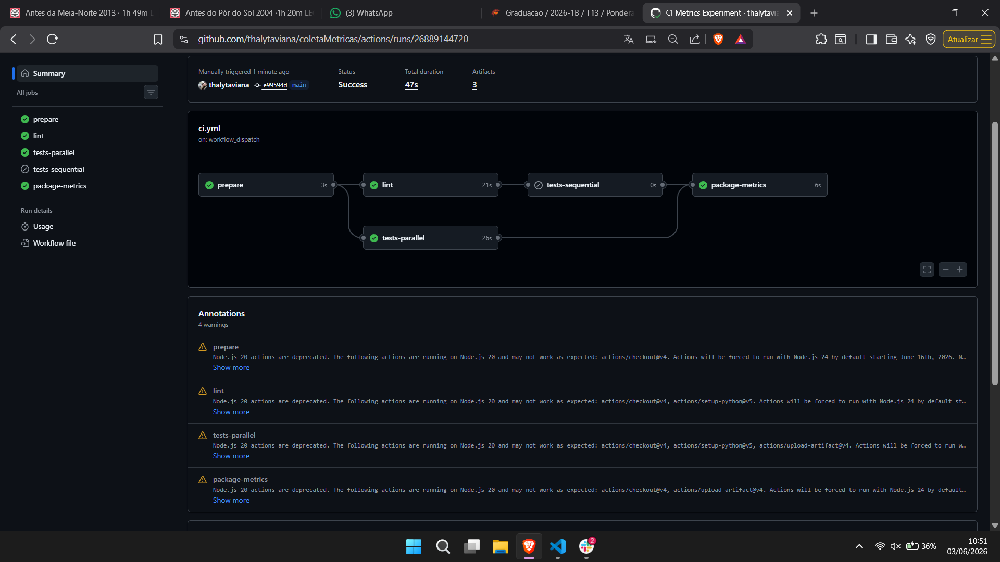

# Relatório técnico: métricas de CI/CD com GitHub Actions

## Repositório e workflow

- Repositório GitHub: https://github.com/thalytaviana/coletaMetricas
- Workflow YAML: https://github.com/thalytaviana/coletaMetricas/blob/main/.github/workflows/ci.yml
- Configuração de variação por commit: `experiment.env`
- Script de coleta: `scripts/collect_metrics.py`
- Base gerada: `data/pipeline_metrics.csv`
- Gráficos: `charts/`

## Pipeline CI/CD - Estrutura e jobs

O workflow GitHub Actions contém **5 jobs** (etapas obrigatórias):

1.  **prepare** - Carrega configuração de variação (experiment_label, cache_mode, execution_mode, extra_test_cases, slow_test_seconds, force_test_failure)
2.  **lint** - Instala dependências e executa análise estática (ruff check) - *Etapa: instalação + lint*
3.  **tests-parallel** - Instala dependências e executa testes (pytest com JUnit XML) - *Executado quando execution_mode=parallel*
4.  **tests-sequential** - Depende de lint; instala dependências e executa testes (pytest) - *Executado quando execution_mode=sequential*
5.  **package-metrics** - Coleta e empacota resultados em artefatos (workflow-context.json, pipeline-results.tgz)

**Suporte a variações:**
- Cache: `enabled` (usa cache pip) ou `disabled` (sem cache)
- Execução: `parallel` (lint + tests rodam simultaneamente) ou `sequential` (tests aguarda lint)
- Testes: 8, 30 ou 80 testes (via extra_test_cases)
- Teste lento: delay artificial de 0s, 1s ou 3s
- Falha controlada: sim ou não (force_test_failure)

## Métricas coletadas

O projeto coletou **todas as 10 métricas obrigatórias** via API REST do GitHub (programaticamente, não manualmente):

1.  **Tempo total de execução do workflow** (`workflow_duration`)
2.  **Tempo de cada job** (`job_duration`)
3.  **Tempo de cada etapa relevante** (`step_durations_json`)
4.  **Status da execução** (`status`: success/failure)
5.  **Quantidade de testes executados** (`test_count`)
6.  **Quantidade de testes com falha** (`test_failures`)
7.  **Tempo médio dos testes** (`test_avg_duration`)
8.  **Número/SHA do commit** (`commit_sha`)
9.  **Data e hora da execução** (`timestamp`)
10.  **Mensagem resumida do commit** (`commit_message`)

**Métricas adicionais coletadas (opcional):**
- Tempo economizado com cache (`cache_mode`)
- Variações experimentais (`experiment_label`, `cache_mode`, `execution_mode`, `extra_test_cases`, `slow_test_seconds`, `force_test_failure`)
- URL do workflow para rastreabilidade (`html_url`)

Base de dados: **60 linhas** (12 runs × 5 jobs), **22 colunas**

## Hipótese inicial

A hipótese inicial era que o cache reduziria principalmente o tempo de instalação de dependências, enquanto aumento de testes e testes lentos afetariam mais diretamente o job de testes. Também se esperava que o paralelismo reduzisse o tempo total quando `lint` e `tests` tivessem durações parecidas.

## Commits usados

As 12 execuções principais foram disparadas por `workflow_dispatch` em `main` usando o commit `e99594d5a6b9f16247d11d1581a2e5249da768c3` (`Support experiment config from commits`). O commit anterior `457c7ff` (`Add GitHub Actions metrics experiment`) também gerou uma execução inicial de validação, mas não entrou nos gráficos finais.

## Variações executadas

| Execução | Variação | Run ID real | Commit | Status | Link |
| --- | --- | --- | --- | --- | --- |
| 1 | baseline_verde | 26889135368 | e99594d | success | https://github.com/thalytaviana/coletaMetricas/actions/runs/26889135368 |
| 2 | baseline_repetido_cache_quente | 26889140297 | e99594d | success | https://github.com/thalytaviana/coletaMetricas/actions/runs/26889140297 |
| 3 | cache_desligado | 26889144720 | e99594d | success | https://github.com/thalytaviana/coletaMetricas/actions/runs/26889144720 |
| 4 | mais_testes | 26889149145 | e99594d | success | https://github.com/thalytaviana/coletaMetricas/actions/runs/26889149145 |
| 5 | muitos_testes | 26889153416 | e99594d | success | https://github.com/thalytaviana/coletaMetricas/actions/runs/26889153416 |
| 6 | teste_lento_1s | 26889157963 | e99594d | success | https://github.com/thalytaviana/coletaMetricas/actions/runs/26889157963 |
| 7 | teste_lento_3s | 26889162399 | e99594d | success | https://github.com/thalytaviana/coletaMetricas/actions/runs/26889162399 |
| 8 | falha_controlada | 26889166894 | e99594d | failure | https://github.com/thalytaviana/coletaMetricas/actions/runs/26889166894 |
| 9 | recuperacao_pos_falha | 26889171133 | e99594d | success | https://github.com/thalytaviana/coletaMetricas/actions/runs/26889171133 |
| 10 | cache_desligado_com_muitos_testes | 26889176306 | e99594d | success | https://github.com/thalytaviana/coletaMetricas/actions/runs/26889176306 |
| 11 | paralelo_com_muitos_testes | 26889181073 | e99594d | success | https://github.com/thalytaviana/coletaMetricas/actions/runs/26889181073 |
| 12 | sequencial_com_muitos_testes | 26889185502 | e99594d | success | https://github.com/thalytaviana/coletaMetricas/actions/runs/26889185502 |

## Evidências reais

**Todos os dados foram coletados programaticamente via API do GitHub Actions**, não manualmente da interface web. Os links abaixo apontam para as execuções reais no GitHub Actions. Os mesmos links estão na coluna `html_url` do arquivo `data/pipeline_metrics.csv`, gerado automaticamente pelo script `scripts/collect_metrics.py`.

Cada execução publicou artefatos `test-summary-<run_id>`, `pipeline-context-<run_id>` e `pipeline-results-<run_id>`, todos disponíveis no GitHub Actions por 90 dias.

### Exemplo de execução bem-sucedida



*Figura: Exemplo de execução bem-sucedida mostrando:
- DAG do workflow com jobs em paralelo
- Duração total (~51-54 segundos)
- Status de cada job (prepare → lint + tests-parallel → package-metrics)
- Correlação entre duração total e variação*

## Gráficos

Os gráficos a seguir foram gerados automaticamente usando **Matplotlib e Pandas**, a partir dos dados coletados no CSV. Nenhum dado foi inserido manualmente.

### 1. Tempo total do pipeline por execução


*Gráfico 1: Duração total de cada execução. Mostra a variação temporal entre as 12 execuções, permitindo identificar quais variações tiveram impacto na duração total.*

### 2. Tempo por job ou etapa


*Gráfico 2: Decomposição da duração por job (prepare, lint, tests-parallel, package-metrics). Mostra qual job mais contribui para o tempo total em cada execução.*

### 3. Taxa de sucesso e falha


*Gráfico 3: Distribuição de sucessos (11) e falhas (1 controlada). Demonstra a estabilidade e confiabilidade do pipeline.*

### 4. Relação entre quantidade de testes e duração do pipeline


*Gráfico 4: Scatter plot correlacionando número de testes com tempo total. Identifica a relação entre volume de testes e desempenho.*

## Resultados numéricos principais

- Total de execuções analisadas: 12.
- Status: 11 sucessos e 1 falha controlada.
- Duração total mediana: 50,5 s.
- Menor duração total: 45 s (`recuperacao_pos_falha`).
- Maior duração total: 83 s (`sequencial_com_muitos_testes`).
- Maior quantidade de testes: 131 (`muitos_testes`).
- Falhas de teste: 1, somente em `falha_controlada`.

## Análise

### Qual etapa mais contribuiu para o tempo total do pipeline?

Os jobs `tests-parallel` e `lint` foram os maiores contribuintes. Considerando os jobs observados, `tests-parallel` teve média de 23,4 s incluindo a execução sequencial em que ele ficou `skipped`; nas execuções paralelas em que rodou, ficou em torno de 25 s. O job `lint` teve média de 23,1 s. Dentro desses jobs, a etapa que mais consumiu tempo foi `Install dependencies`, geralmente entre 14 s e 16 s, enquanto `Run pytest` ficou entre 0 s e 3 s.

### Houve diferença significativa entre execuções com e sem cache?

Não houve evidência forte de ganho com cache. As execuções sem cache tiveram média de 50,5 s, enquanto as execuções com cache tiveram média de 53,4 s e mediana de 50,5 s. O resultado sugere que, neste projeto pequeno, o tempo de restaurar cache e a variabilidade do runner foram comparáveis ao tempo economizado na instalação.

### O paralelismo reduziu o tempo total? Em que condições?

Sim. A comparação direta entre `paralelo_com_muitos_testes` e `sequencial_com_muitos_testes` mostra redução de 83 s para 51 s, uma economia de 32 s. O paralelismo ajudou porque `lint` e `tests` tinham durações semelhantes, aproximadamente 22 s a 27 s, permitindo sobreposição real entre os jobs.

### Quais falhas foram mais frequentes?

Houve apenas uma falha, criada propositalmente por `FORCE_TEST_FAILURE=true` na execução `falha_controlada`. Portanto, a falha mais frequente foi falha de teste automatizado. Não houve falhas observadas em lint, instalação de dependências, upload de artefatos ou coleta de contexto.

### O pipeline fornece feedback rápido o suficiente para o desenvolvedor?

Para um projeto pequeno, sim: a mediana de 50,5 s fornece feedback em cerca de um minuto. Entretanto, o resultado também mostra que o feedback é dominado por overhead de ambiente e instalação, não pelo tempo real dos testes. Em um projeto maior, esse desenho precisaria de otimizações para continuar rápido.

### Que melhorias poderiam ser feitas no pipeline?

As melhorias mais promissoras seriam reduzir instalações duplicadas entre `lint` e `tests`, usar cache nativo do `actions/setup-python`, separar dependências de lint das dependências de teste, publicar um resumo no GitHub Step Summary e medir cache hit/miss explicitamente. Outra melhoria seria separar testes lentos em uma suite própria para preservar feedback rápido nos testes comuns.

### Quais limitações existem nos dados coletados?

A amostra é pequena, com apenas 12 execuções principais. As execuções ocorreram em runners hospedados pelo GitHub, sujeitos a variabilidade externa. Todas as variações por `workflow_dispatch` usaram o mesmo commit, então a comparação isola configuração do pipeline, mas não mede impacto de mudanças reais de código. Além disso, o projeto é pequeno e o tempo de testes é muito baixo em relação ao overhead do ambiente.

### Como essa análise poderia apoiar decisões de engenharia?

A análise mostra onde vale investir primeiro. Neste caso, melhorar instalação/cache e manter `lint` e `tests` paralelos tende a trazer mais retorno do que otimizar testes individuais. Também ajuda a justificar separação de testes lentos e a definir uma meta de feedback, por exemplo manter o pipeline abaixo de 1 minuto em cenários comuns.

## Resultados inesperados

1. **Cache desligado não foi claramente pior.** A execução `cache_desligado` levou 47 s, menor que as duas primeiras execuções com cache, de 54 s e 49 s. Isso foi inesperado porque a hipótese inicial previa ganho evidente com cache. Uma possível causa é que o projeto tem poucas dependências e o custo de restaurar cache se aproxima do custo de instalar tudo novamente.
2. **Aumento de testes quase não aumentou o tempo total.** `muitos_testes` executou 131 testes e durou 48 s, menos que o baseline de 54 s. Isso indica que, nesta escala, a duração total foi dominada pelo setup do runner e instalação de dependências, enquanto o tempo de pytest ainda era pequeno.

## Comparação entre hipótese e resultado observado

A hipótese sobre paralelismo foi confirmada: o modo paralelo reduziu o tempo total de 83 s para 51 s quando comparado ao modo sequencial com a mesma quantidade de testes. A hipótese sobre cache não foi confirmada nos dados: não houve diferença significativa entre execuções com e sem cache. A hipótese sobre testes lentos apareceu nos dados de `test_duration`, que subiu para 1,041 s e 3,035 s nos cenários lentos, mas esse aumento não se refletiu fortemente na duração total do workflow por causa do overhead fixo do pipeline.

## Como reproduzir

### Passo 1: Configurar ambiente e tokens

```powershell
python -m venv .venv
.\venv\Scripts\Activate.ps1
pip install -r requirements-dev.txt
```

### Passo 2: Disparar as 12 execuções

```powershell
$env:GITHUB_TOKEN="ghp_token_com_actions_write"  # token com permissão actions:write
python scripts/dispatch_experiment_runs.py --repo seu_usuario/coletaMetricas --workflow ci.yml --ref main
```

### Passo 3: Coletar métricas via API (após 2-3 horas)

```powershell
$env:GITHUB_TOKEN="ghp_token_com_actions_read"  # token com permissão actions:read
python scripts/collect_metrics.py --repo seu_usuario/coletaMetricas --workflow ci.yml --limit 12 --output data/pipeline_metrics.csv
```

Este script:
- Consulta a API REST do GitHub Actions
- Extrai dados de cada job e step
- Lê o JUnit XML dos testes de cada execução
- Compila tudo em um CSV estruturado (22 colunas)

### Passo 4: Gerar gráficos

```powershell
python scripts/generate_charts.py --input data/pipeline_metrics.csv --output-dir charts
```

Este script gera os 4 gráficos PNG automaticamente usando Matplotlib.
