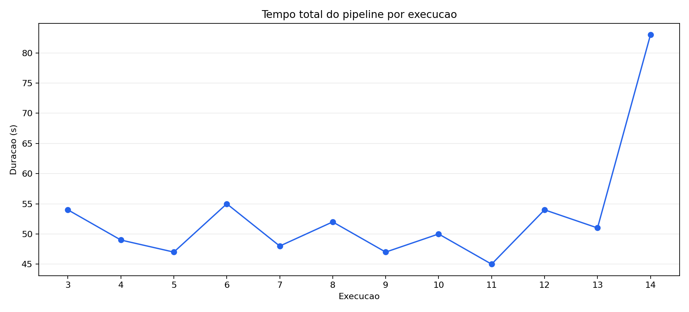
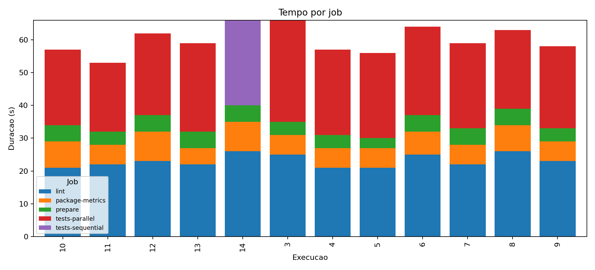
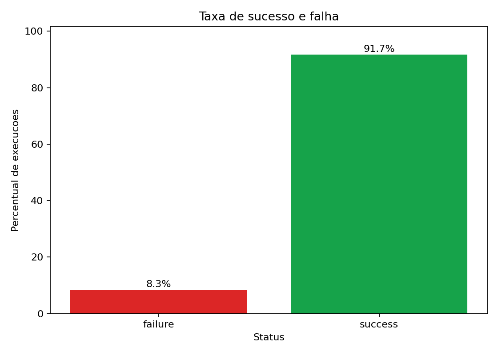
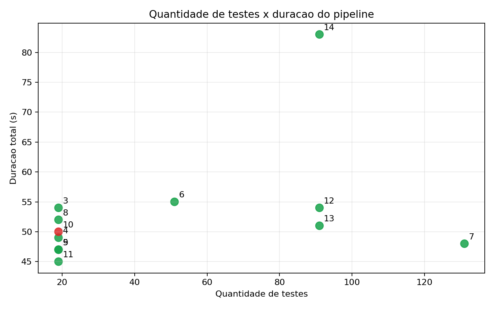

# Relatorio tecnico: metricas de CI/CD com GitHub Actions

## Repositorio e workflow

- Repositorio GitHub: https://github.com/thalytaviana/coletaMetricas
- Workflow YAML: https://github.com/thalytaviana/coletaMetricas/blob/main/.github/workflows/ci.yml
- Configuracao de variacao por commit: `experiment.env`
- Script de coleta: `scripts/collect_metrics.py`
- Base gerada: `data/pipeline_metrics.csv`
- Graficos: `charts/`

> Atencao: as evidencias abaixo devem ser preenchidas somente depois das 12 execucoes reais no GitHub Actions. Relatorio sem IDs e links reais nao atende ao criterio da atividade.

## Hipotese inicial

A hipotese inicial e que o cache reduz principalmente o tempo de instalacao de dependencias, enquanto aumento de testes e testes lentos afetam mais diretamente o job `tests`. Tambem se espera que falhas controladas aumentem pouco a duracao total, pois o pipeline publica artefatos antes de encerrar com erro.

## Variacoes executadas

As variacoes planejadas estao em `data/experiment_plan.csv`.
Cada execucao pode ser gerada por `workflow_dispatch` ou por commit alterando `experiment.env`.

| Execucao | Variacao | Run ID real | Commit | Status | Link |
| --- | --- | --- | --- | --- | --- |
| 1 | baseline_verde | preencher | preencher | preencher | preencher |
| 2 | baseline_repetido_cache_quente | preencher | preencher | preencher | preencher |
| 3 | cache_desligado | preencher | preencher | preencher | preencher |
| 4 | mais_testes | preencher | preencher | preencher | preencher |
| 5 | muitos_testes | preencher | preencher | preencher | preencher |
| 6 | teste_lento_1s | preencher | preencher | preencher | preencher |
| 7 | teste_lento_3s | preencher | preencher | preencher | preencher |
| 8 | falha_controlada | preencher | preencher | preencher | preencher |
| 9 | recuperacao_pos_falha | preencher | preencher | preencher | preencher |
| 10 | cache_desligado_com_muitos_testes | preencher | preencher | preencher | preencher |
| 11 | paralelo_com_muitos_testes | preencher | preencher | preencher | preencher |
| 12 | sequencial_com_muitos_testes | preencher | preencher | preencher | preencher |

## Evidencias reais

Inclua aqui links ou prints das execucoes reais do GitHub Actions. Os links podem ser obtidos na coluna `html_url` do CSV gerado por `scripts/collect_metrics.py`.

## Graficos

Depois de executar `python scripts/generate_charts.py`, incluir:









## Analise

### Qual etapa mais contribuiu para o tempo total do pipeline?

Preencher usando o grafico de tempo por job e a coluna `step_durations_json`. Compare os jobs `lint`, `tests` e `package-metrics`.

### Houve diferenca significativa entre execucoes com e sem cache?

Preencher comparando as execucoes `cache_desligado`, `cache_desligado_com_muitos_testes` e equivalentes com `cache_mode=enabled`.

### O paralelismo reduziu o tempo total? Em que condicoes?

Compare `paralelo_com_muitos_testes` com `sequencial_com_muitos_testes`, que usam a mesma quantidade de testes e cache ligado. O modo sequencial faz `tests-sequential` depender de `lint`, enquanto o modo paralelo permite sobreposicao entre `lint` e `tests-parallel`.

### Quais falhas foram mais frequentes?

Preencher a partir de `status`, `job_status`, `test_failures` e da execucao `falha_controlada`.

### O pipeline fornece feedback rapido o suficiente para o desenvolvedor?

Preencher com base na mediana das duracoes totais e no tempo ate o primeiro job relevante falhar ou passar.

### Que melhorias poderiam ser feitas no pipeline?

Possiveis melhorias a validar: separar testes lentos, ajustar chaves de cache, publicar resumo no GitHub Step Summary, quebrar suites por matriz e reduzir dependencias instaladas em jobs simples.

### Quais limitacoes existem nos dados coletados?

Limitacoes esperadas: amostra pequena, variabilidade dos runners hospedados pelo GitHub, cache compartilhado por chave, execucoes em horarios diferentes e variacoes artificiais que nao representam todo um projeto real.

### Como essa analise poderia apoiar decisoes de engenharia?

A analise apoia decisoes sobre paralelismo, investimento em cache, separacao de testes lentos, ordem de jobs e criterios para manter feedback rapido ao desenvolvedor.

## Resultados inesperados

1. **Preencher resultado inesperado 1:** descreva o observado, a evidencia no CSV/grafico e uma possivel causa.
2. **Preencher resultado inesperado 2:** descreva o observado, a evidencia no CSV/grafico e uma possivel causa.

## Comparacao entre hipotese e resultado observado

Preencher depois da coleta. Compare explicitamente a hipotese inicial com os dados reais, citando run IDs e commits.

## Como reproduzir

```powershell
python -m venv .venv
.\.venv\Scripts\Activate.ps1
pip install -r requirements-dev.txt

$env:GITHUB_TOKEN="ghp_token_com_actions_read"
python scripts/dispatch_experiment_runs.py --repo thalytaviana/coletaMetricas --workflow ci.yml --ref main

python scripts/collect_metrics.py --repo thalytaviana/coletaMetricas --workflow ci.yml --limit 30 --output data/pipeline_metrics.csv
python scripts/generate_charts.py --input data/pipeline_metrics.csv --output-dir charts
```
